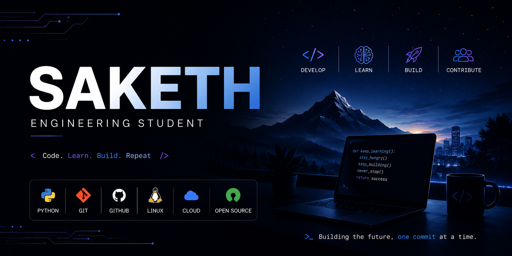

# Hi, I'm Saketh 👋

### Engineering Student • AI • Python • Linux • Cloud • Open Source

Building projects, strengthening computer science fundamentals, and documenting my learning journey.

---

## 🚀 About Me

- 🎓 Engineering Student
- 🐍 Currently focused on Python development
- 🧩 Practicing Data Structures & Algorithms
- 🐧 Exploring Linux and open-source technologies
- ☁️ Learning cloud computing fundamentals
- 🤖 Interested in Artificial Intelligence & Machine Learning
- 🌱 Building projects and improving every day

---

## 💻 Tech Stack

### Languages & Tools


---

## 📚 Currently Learning


---

## 🎯 Current Goals

- [ ] Build 10+ quality projects
- [ ] Improve problem-solving skills
- [ ] Learn Docker & DevOps fundamentals
- [ ] Contribute to Open Source
- [ ] Build AI-powered applications

---

## 🌟 Featured Repositories

| Project | Description |
|----------|------------|
| FootprintIQ | AI-powered carbon intelligence platform |
| Python Learning | Notes, exercises and mini-projects |
| DSA Practice | Problem-solving journey |
| Linux Notes | Linux commands, concepts and experiments |
| Future AI Projects | Machine learning and AI explorations |

---

## 📈 Current Focus

```text
Python        ████████░░
Git/GitHub    ███████░░░
Linux         ██████░░░░
DSA           █████░░░░░
Cloud         ███░░░░░░░
AI/ML         ███░░░░░░░
```

---

## 📖 Philosophy

> Learn consistently. Build publicly. Improve continuously.

---

### Thanks for visiting! 🚀

<!--
**Saketh-dev7/Saketh-dev7** is a ✨ _special_ ✨ repository because its `README.md` (this file) appears on your GitHub profile.

Here are some ideas to get you started:

- 🔭 I’m currently working on ...
- 🌱 I’m currently learning ...
- 👯 I’m looking to collaborate on ...
- 🤔 I’m looking for help with ...
- 💬 Ask me about ...
- 📫 How to reach me: ...
- 😄 Pronouns: ...
- ⚡ Fun fact: ...
-->
